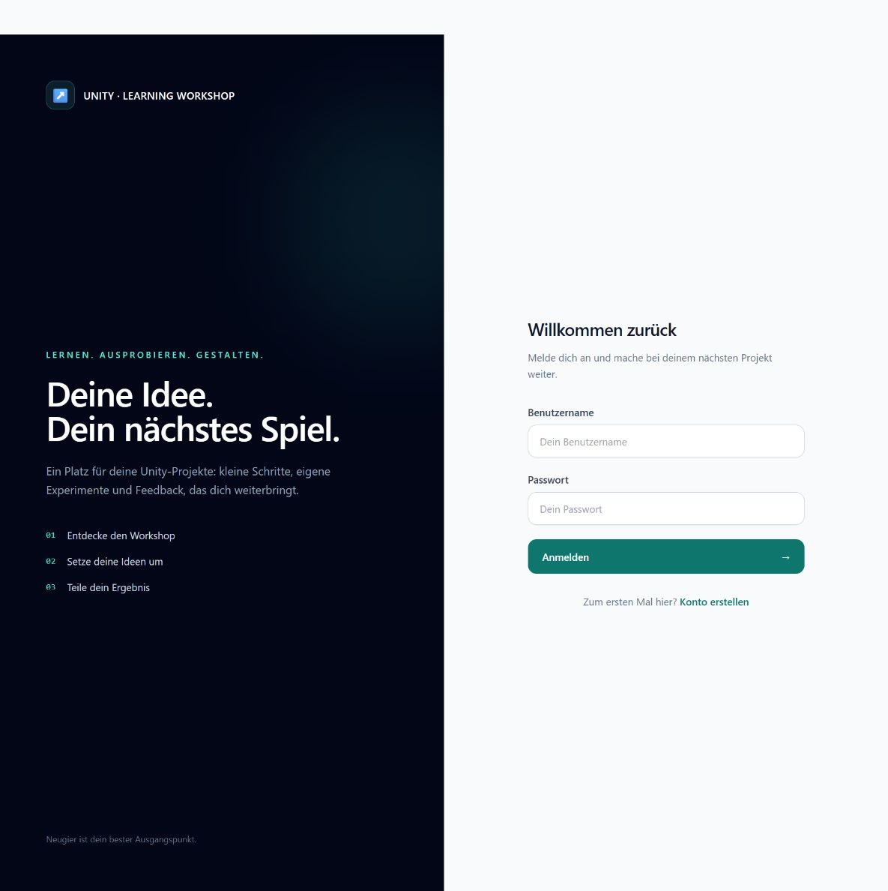
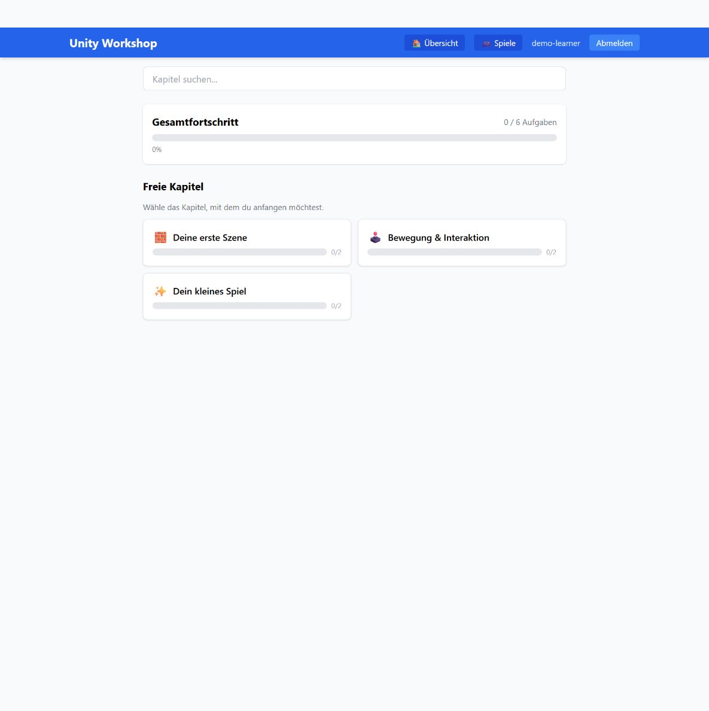
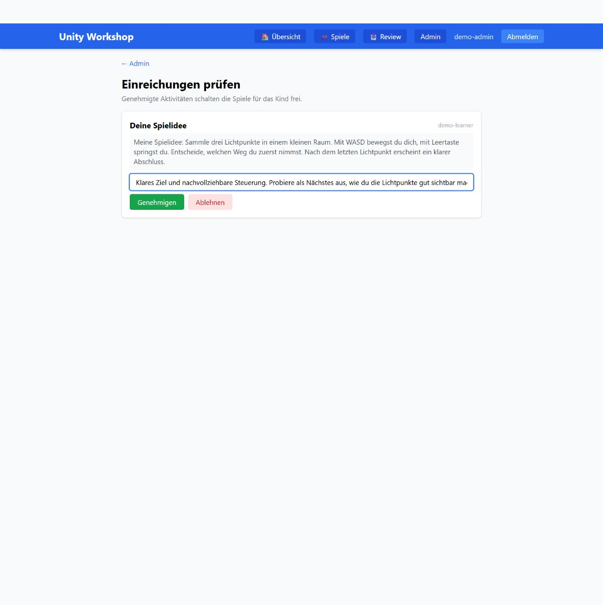
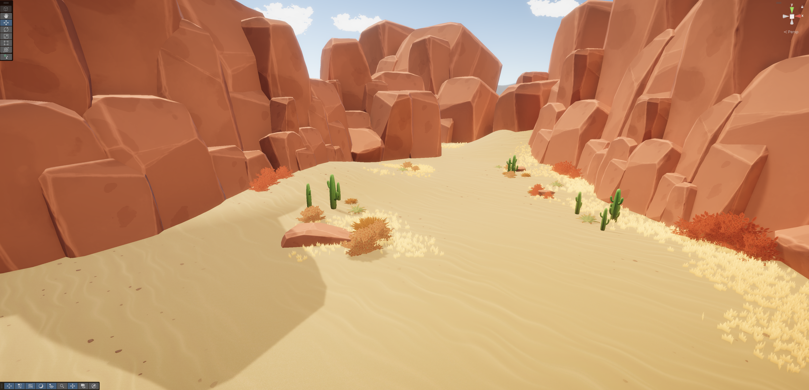
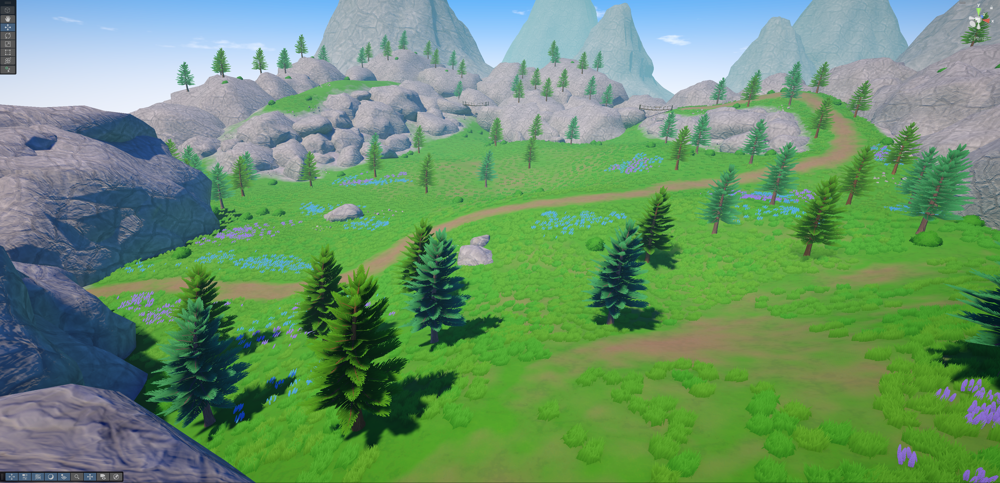
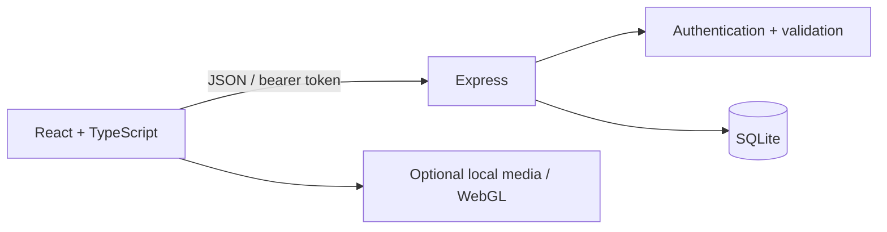

# Workshop Learning Platform

**A full-stack learning platform for hands-on Unity workshops.** Learners explore chapters, track progress and submit exercises. Instructors organize groups, adapt lessons and give feedback in the same application.

React · TypeScript · Express · SQLite · Tailwind · Unity / C# sample



## Try the workflow

1. Sign in as a learner, open a chapter and complete a task.
2. Submit a short game idea in **Selbstlernen**.
3. Switch to the instructor account and review the submission.
4. Return as the learner to see the feedback and unlocked games section.

The included demo uses fictional accounts and newly written text. It runs without Unity, external services, API keys or downloaded media. The UI is in German; developer documentation is in English.

## Run locally

Use **Node.js 22** with npm:

```sh
git clone https://github.com/Tigertycoon/workshop-learning-platform.git
cd workshop-learning-platform
npm run setup
npm run demo
npm run dev
```

Open **http://127.0.0.1:5173**. Setup installs the locked dependencies and generates unique local secrets in `app/.env`; it leaves an existing environment file unchanged.

| Demo account | Password variable in `app/.env` | Role |
| --- | --- | --- |
| `demo-learner` | `DEMO_STUDENT_PASSWORD` | Chapters, progress and submissions |
| `demo-admin` | `DEMO_ADMIN_PASSWORD` | Groups, lesson editing and reviews |

`npm run demo` creates three chapters, six tasks and three exercises. It leaves an occupied database untouched. Do not commit `.env` or database files.

To run the built frontend locally, use `npm run build` followed by `npm start`, then visit **http://127.0.0.1:3001**.



## Features and engineering

| Area | Implementation |
| --- | --- |
| Learning workflow | Chapter prerequisites, task checklists, persistent progress and search |
| Instructor tools | Groups, join codes, lesson editing, individual/group task overrides and CSV progress export |
| Feedback | Exercise submission, review queue and time-limited game unlock after approval |
| API | Server-side role checks, Zod validation, parameterized SQLite queries and transactional content updates |
| Authentication | Bcrypt password hashes, expiring JWTs, current-role checks and login/registration rate limits |
| Media | Size-limited instructor uploads with generated filenames; optional locally supplied WebGL builds |
| Verification | Real HTTP integration tests against isolated SQLite databases, TypeScript checks and CI |

The game portal demonstrates the hosting workflow. Generated game builds are kept outside Git and can be supplied locally. The web demo starts with an empty catalog. Static game files are public to the local server; the UI unlock is a learning incentive, not DRM.



## Unity work

The [Unity sample](unity/README.md) contains a small scene and a C# runtime GLB loader using glTFast. It includes a bridge model, resolves its local path relative to the project, and exposes byte-buffer and URL loading methods for further integration. This is a focused prototype, not a complete game or a finished web-to-Unity workflow.

These screenshots show examples from my broader Unity workshop work. They are separate from the minimal runtime-loading scene included here.




## Architecture



The single-process server and embedded database keep a local workshop easy to run. Related content updates use transactions so a failed write cannot leave half a lesson behind. The web demo is independent of the optional game builds.

```text
app/client/      React interface and Vite configuration
app/server/      Express routes, SQLite schema, synthetic demo and tests
unity/           Unity sample project, C# GLB loader and bridge model
scripts/        Repeatable setup, dependency audit and publication checks
docs/           Architecture, validation and demo screenshots
```

## Quality checks

```sh
npm run check               # typechecks, API integration tests and client build
npm run audit               # all three application dependency lockfiles
npm run publication:check   # tracked-file boundary; requires a Git checkout
```

[GitHub Actions](https://github.com/Tigertycoon/workshop-learning-platform/actions) repeats these checks and scans the complete repository history with Gitleaks. See [validation](docs/VALIDATION.md) and [architecture](docs/ARCHITECTURE.md) for details.

This is a local portfolio prototype combining a TypeScript web/API application with a focused Unity/C# sample. It does not claim to be a production service, a finished game or an XR application. See [security and deployment limits](SECURITY.md) before considering internet hosting.

Source is presented for portfolio review. No open-source license is granted; dependency licenses remain with their respective authors. See [notices](NOTICE.md).
